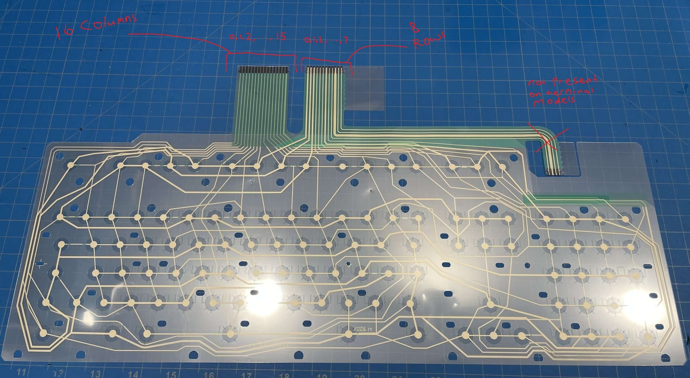
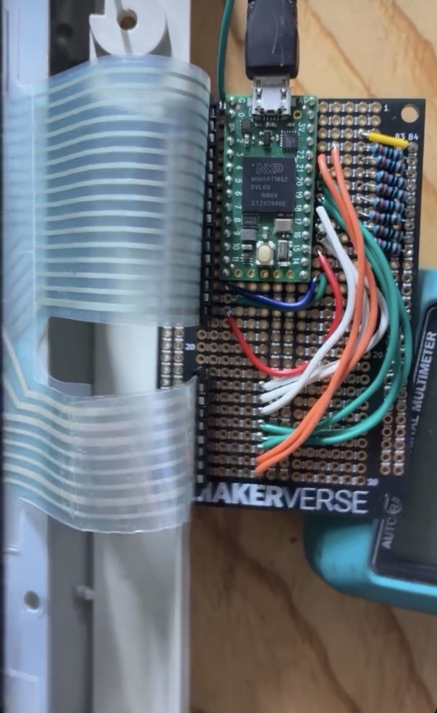

# What is this project?
This repo contains the firmware I wrote to convert my 102-key terminal model m 1392595 (which previously ran on the PS/2 protocol via an rj45 ethernet cable) to native usb. The board I built using this code and a teensy 4.0 replaces the stock controller inside the case.

# How to build and upload
The firmware is written for a teensy 4.0 microcontroller and utilises the teensyduino usb library, which should be easy to set up using [this](https://www.pjrc.com/teensy/td_download.html) and [this](https://www.pjrc.com/teensy/td_keyboard.html) guide and the arduino IDE. Once your IDE is set up you should just be able to open keyboard/keyboard.ino in the IDE and press upload.

# How to wire the controller
As the code stands, pins 0-15 (inclusive) on the controller correspond to columns 0-15 on the keyboard membrane matrix, and pins 16-23 (inclusive) correspond to rows 0-7:

Here is how mine looked in the end

The code uses an active low signals, hence why there are pull up resistors hooked up to the 3.3v output. You can also use the teensy's internal pull up resistors. If you look next to the micro usb port on the image above you will see a green wire going off the left of the image. This connects the microcontroller ground to the steel plate inside the keyboard for ESD protection.

The membrane ribbon connectors can be acquired from digikey. Part numbers are 5-520315-8-ND for the 8-pin connector and 6-520315-6-ND for the 16 pin connector.

# Alterations to the code
The core logic of the code is just to scan every combination of column and row, look for ghosting and block signals when detected, as well as some lockout debounce. Therefore, the code could be modified to work for pretty much any keyboard so long as you correctly configure the rows, columns, and keymap.
